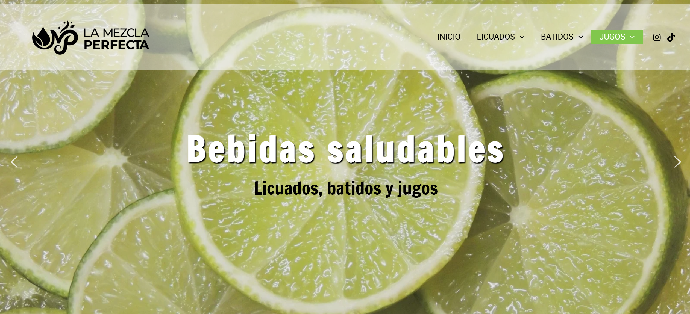
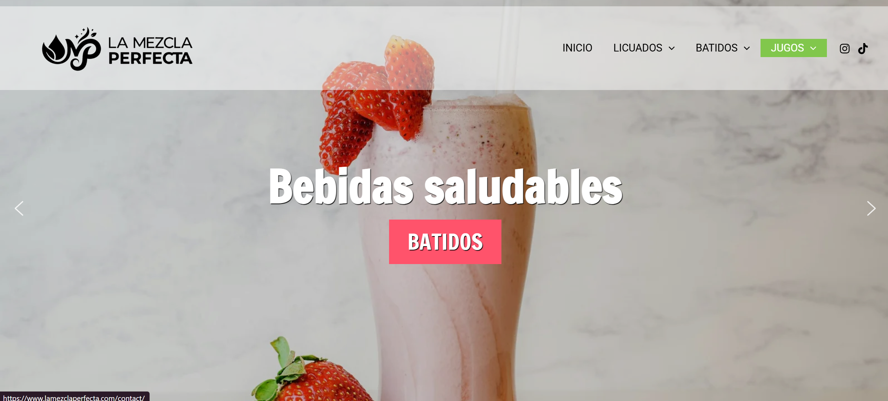
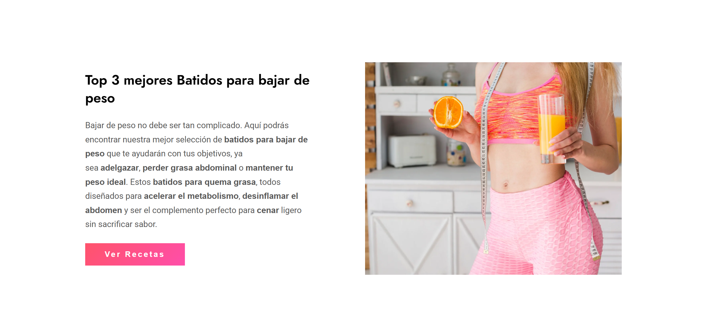
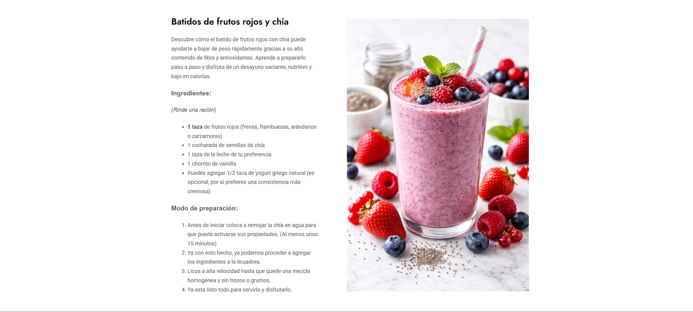

# 🎨 Diseño y Maquetación Web: WordPress

Este proyecto documenta mi colaboración en el diseño visual y la experiencia de usuario de un sitio web desarrollado en la plataforma **WordPress**. Mi enfoque principal fue mejorar la estética y la interactividad del sitio para ofrecer una navegación más fluida. Diseño adaptado fielmente a los requerimientos y manual de identidad proporcionados por el cliente

### 🛠️ Herramientas y Tecnologías
*   **CMS:** WordPress.
*   **Diseño Visual:** Implementación de maquetadores visuales y personalización de temas.
*   **Estilos:** Ajustes mediante CSS personalizado, botones interactivos que redireccionan.
*   **Optimización:** Edición de recursos gráficos para mejorar el rendimiento web.

### ✨ Características Destacadas
*   **Implementación de Sliders dinámicos:** Configuré y añadí sliders en las secciones clave para resaltar promociones y contenido importante, mejorando significativamente el impacto visual al entrar al sitio.
*   **Maquetación de Secciones:** Colaboré en la estructuración de páginas principales, asegurando que el contenido fuera legible y organizado.
*   **Personalización de Marca:** Ajustes detallados en tipografías, colores y espaciados para mantener la coherencia visual.

### 📸 Vista Previa
A continuación, se presentan capturas que muestran el diseño y el funcionamiento de los elementos dinámicos instalados:

---
*Proyecto realizado como parte de una colaboración en desarrollo web.*
